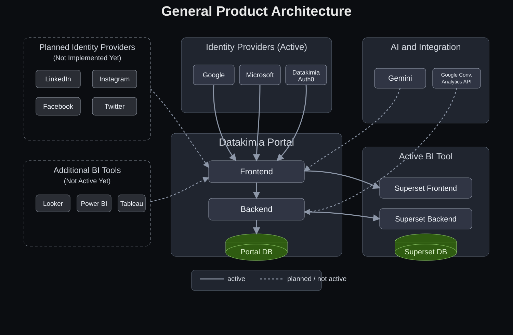

# General Product Architecture

## High-Level View

Datakimia's product is organized around three main application areas:

- **Product Portal**: the core user-facing application, composed of a Frontend and Backend.
- **BI Tool Layer**: analytics consumption and exploration, with Apache Superset currently active.
- **Identity & Integrations**: centralized authentication and external services that connect data and AI capabilities.

At a high level, users authenticate from the Portal Frontend using provider-specific login options (Google, Microsoft, or Datakimia Auth0). Once authenticated, they can access both the Product Portal and BI tools. The Portal Backend and BI Backend each connect to their own data stores and can exchange data/integration flows to keep analytics and product experiences aligned.

Current status by capability:

- **Active**: Google/Microsoft/Datakimia (Auth0) IdPs, Product Portal, Apache Superset.
- **Integrated but not used**: Looker.
- **Planned (future)**: LinkedIn/Instagram/Facebook/Twitter as OAuth2 IdPs, Power BI, Tableau.

## Architecture Diagram

## Scope Notes

- This diagram is intentionally **high-level** and focuses on system boundaries and primary interactions.
- Exact protocols, deployment topology, and environment-specific details are documented separately.
- Status notation used in this diagram: **solid = active**, **dashed = integrated but not used / planned** (see edge labels).
- Each BI product has its own architecture; Superset is shown in detail (frontend/backend/DB), while other BI tools are intentionally abstracted.
