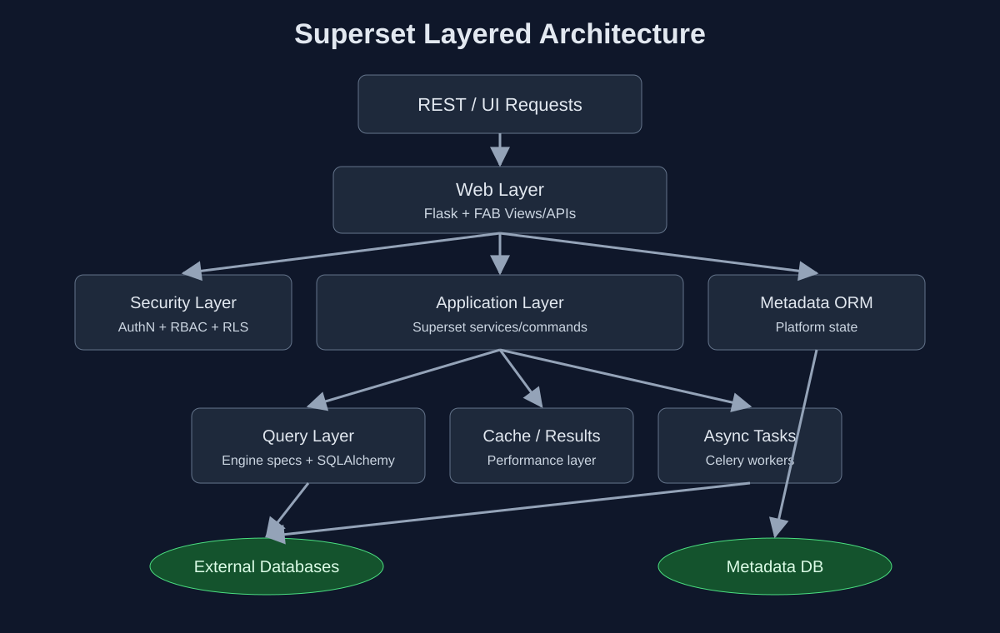

# Superset Backend Architecture

## Purpose

The Superset backend provides:

- Authentication, session management, and RBAC authorization.
- Metadata APIs for databases, datasets, charts, dashboards, SQL Lab, and reports.
- Query orchestration toward external SQL engines.
- Integration points for caching, async workers, and alerts/reports.

## Layered Architecture

## Main Layers and Responsibilities

- **Web/API layer**
  - Handles HTTP requests from UI and API clients.
  - Normalizes payloads and delegates to Superset services.
- **Security layer**
  - Enforces role permissions and object-level access.
  - Applies row-level security policies where configured.
- **Application/service layer**
  - Core business logic for exploration, dashboards, and SQL Lab.
  - Coordinates cache and async operations.
- **Metadata layer**
  - Persists platform state: users, roles, datasets, charts, dashboards, reports.
- **Query/engine layer**
  - Encapsulates engine-specific SQL behavior and capability checks.
  - Executes against external warehouses, not metadata DB.

## Key Characteristics

- Strong separation between metadata storage and analytical data sources.
- Engine abstraction via DB engine specs and SQLAlchemy.
- Extensibility through plugins, feature flags, and custom configuration.
- Horizontal scalability via stateless web nodes + shared metadata/cache/task backends.
