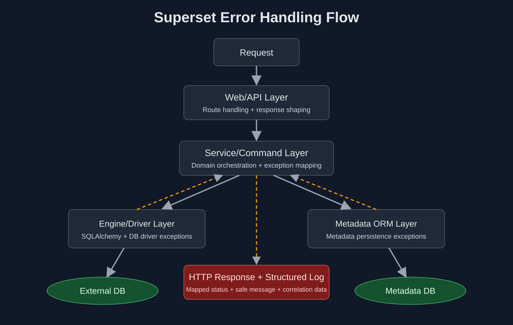

# Errores y Logging (Datakimia)

## Alcance

Esta guia cubre solo criterios operativos de Datakimia para diagnostico en Superset.

- No reemplaza la documentacion tecnica interna del core de Superset.

## Flujo de diagnostico

## Reglas operativas

- Para incidentes de acceso, validar primero rol/permisos de usuario.
- Para incidentes de dashboard, validar ownership, permisos de dataset y fuente.
- Para incidentes de login SSO, validar mapeo de identidad a roles de Superset.

## Logging minimo recomendado

- Mantener `INFO`/`ERROR` para operacion.
- Usar `DEBUG` solo temporalmente para analisis.
- Nunca exponer secretos/tokens en logs compartidos.

## Checklist rapido de troubleshooting

1. Reproducir con usuario afectado (no admin).
2. Validar rol y permisos efectivos.
3. Revisar conectividad a base/dataset asociado.
4. Confirmar si hubo cambio reciente de config o release.
